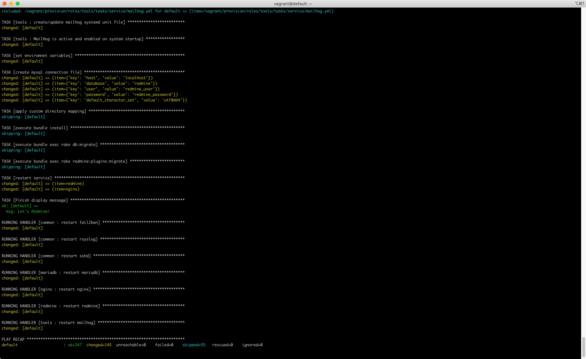

redmine.tokyo 第22回勉強会
==========================


「俺たちの最強のRedmineを語る」発表資料
--------------------------

デモ環境の構築に必要な物
--------------------------

* [Vagrant](https://www.vagrantup.com/)
* [VirtualBox](https://www.virtualbox.org/)

利用方法
--------------------------

1. 以下のリポジトリからデモ環境構構築キットを取得します  
   https://github.com/histudy/vagrant-redmine
2. 本リポジトリから設定用ファイル一式を取得します
3. `extra_vars.yml`をデモ環境構構築キット直下に移動します
4. `vagrant`コマンドを実行しRedmineデモ環境を構築します

### 一括実行コマンド

上記手順を一括で行うコマンドは以下の通りです。

```
git clone https://github.com/histudy/vagrant-redmine.git
cd vagrant-redmine
git clone https://github.com/wate/redmine_tokyo_22.git
cp redmine_tokyo_22/extra_vars.yml ./
vagrant up
```

以下のように画面に表示されたらデモ環境の構築は完了です。

```
TASK [Finish display message] **************************************************
ok: [default] =>
  msg: Let's Redmine!
```



デモ環境へのログイン方法
--------------------------

### 1. Redmineのデモ環境を開く

ブラウザから[http://localhost:8080](http://localhost:8080)を開きます。

### 2. Redmineにログインする

初期構築時のRedmineのログイン情報は以下の通りです。

* ユーザー名：`admin`
* パスワード：`redmineadmin`

補足事項
--------------------------

以下のプラグインはGithub等から直接取得できないため、  
ダウンローズ済みのファイルを同梱しています。

* [Easy Gantt plugin](https://www.easyredmine.com/redmine-gantt-plugin)
* [Redmine Checklists plugin (Light version)](https://www.redmineup.com/pages/ja/plugins/checklists)
