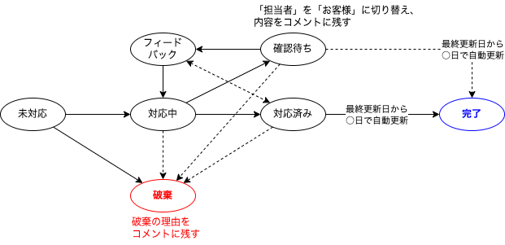

Home
=======================

問い合わせのステータスについて
---------------------------

ステータス
---------------------------

各チケットがどのような状態なのかを表してます。

### 未着手

まだ何も作業を開始していない状態を表しています。

### 対応中

現在対応しているの状態を表しています。

### 対応済み

対応が終了し、担当者がテストや確認中の状態を表しています。

### 確認待ち

何かしらの理由により確認待ちになっている状態を表しています。  
※このステータスに変更する場合は、同時に「担当者」を確認を実施する対象者に変更します。

### フィードバック

「確認待ち」の内容に対して回答を返した状態を表しています。  
※このステータスに変更する場合は、同時に「担当者」を元の担当者に変更します。

### 完了

チケットの対応が終わり完了した状態を表しています。  
※このステータスに変更する場合は、コメントに完了理由を記載しステータスを変更します。

### 破棄

何かしらの理由によりチケットの対応は行わなかった状態を表しています。  
※このステータスに変更する場合は、コメントに破棄理由を記載しステータスを変更します。

### 保留

何かしらの理由により、作業が中断になっている状態を表しています。
※通常は利用しません

### 経過観察

不具合の事象が再現しない/対応は終了しているが、何かしらの理由によりしばらく様子を見ないといけないなど、  
経過観察が必要な状態を表しています。
※通常は利用しません

